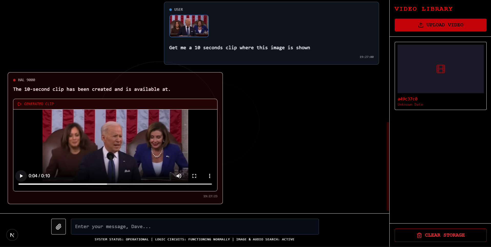

<div align="center">

# 🎬 MOSAIC

### Multimodal Orchestration for Synthesis, Analysis & Intelligent Comprehension

[](LICENSE)
[](https://www.python.org/downloads/)
[](https://nextjs.org/)
[](https://react.dev/)
[](https://www.typescriptlang.org/)
[](https://fastapi.tiangolo.com/)
[](https://www.langchain.com/)
[](https://www.docker.com/)
[](https://www.trychroma.com/)
[](https://faiss.ai/)
[](https://groq.com/)
[](https://mistral.ai/)
[](https://ffmpeg.org/)
[](https://pytorch.org/)

**AI-powered video analysis platform for multimodal content understanding and intelligent search**

</div>

---

## 📋 Table of Contents

- [Overview](#-overview)
- [Demo & Screenshots](#-demo--screenshots)
- [Features](#-features)
- [Architecture](#-architecture)
- [Quick Start](#-quick-start)
- [Installation](#-installation)
- [Usage](#-usage)
- [API Reference](#-api-reference)
- [Configuration](#-configuration)
- [Development](#-development)
- [Project Structure](#-project-structure)
- [Technologies](#-technologies)
- [Contributing](#-contributing)
- [License](#-license)

---

## 🎯 Overview

**MOSAIC** is a cutting-edge video understanding platform that allows you to interact with video content using natural language. Upload videos, ask questions about their content, search across visual and spoken elements, and automatically extract relevant clips—all powered by state-of-the-art AI models.

### What Makes MOSAIC Unique?

- **🧠 Multimodal Understanding**: Combines vision, audio, and text analysis for comprehensive video comprehension
- **🔍 Intelligent Search**: Find specific moments using natural language queries across transcripts, visuals, and AI-generated captions
- **✂️ Smart Clip Generation**: Automatically extract video segments based on search results
- **💬 Conversational Interface**: Chat with your videos using an AI agent that understands context
- **⚡ High Performance**: Built with FastAPI and optimized vector databases (FAISS + ChromaDB)
- **🐳 Production Ready**: Fully containerized with Docker for seamless deployment

---

## 🎥 Demo & Screenshots

### Application Interface

<div align="center">
  
  <p><em>MOSAIC's intuitive chat interface for video analysis</em></p>
</div>

### Video Examples

Watch MOSAIC in action:

#### Example 1: Visual Search & Frame Analysis

<video width="800" controls>
  <source src="assets/Mosaic_out2.mp4" type="video/mp4">
  Your browser does not support the video tag.
</video>

_Demonstrates visual similarity search and frame-by-frame analysis capabilities_

#### Example 2: Transcript Search & Clip Generation

<video width="800" controls>
  <source src="assets/Mosaic_out1.mp4" type="video/mp4">
  Your browser does not support the video tag.
</video>

_Shows intelligent transcript search and automatic clip extraction from search results_

#### Example 3: Multi-Modal Query Processing

<video width="800" controls>
  <source src="assets/Mosaic_out3.mp4" type="video/mp4">
  Your browser does not support the video tag.
</video>

_Highlights natural language queries combining visual and textual search across video content_

---

## ✨ Features

### Core Capabilities

| Feature                         | Description                                                            |
| ------------------------------- | ---------------------------------------------------------------------- |
| **📹 Video Processing**         | Automatic frame extraction, audio transcription, and metadata analysis |
| **🔎 Transcript Search**        | Find spoken content using natural language text queries                |
| **🖼️ Visual Search**            | Locate frames using CLIP-powered visual-semantic similarity            |
| **📝 Caption Search**           | Search through AI-generated frame descriptions                         |
| **✂️ Clip Extraction**          | Generate video clips from search results with precise timestamps       |
| **📊 Content Summarization**    | Get AI-generated summaries of video content                            |
| **💬 Natural Language Queries** | Ask questions about video content in plain English                     |
| **🎯 Multi-Video Management**   | Process and search across multiple video files                         |

### AI Models & Technologies

- **Vision**: `llama-4-maverick-17b-128e-instruct` (Groq) for image understanding
- **Audio**: `whisper-large-v3-turbo` (Groq) for speech-to-text
- **Embeddings**: `clip-ViT-B-32` for visual similarity, `all-MiniLM-L6-v2` for text
- **LLM**: `mistral-large-latest` for intelligent agent reasoning
- **Framework**: LangChain ReAct agent for orchestration

### 🚀 GPU Acceleration

MOSAIC supports **NVIDIA GPU acceleration** for significantly faster processing:

- **10-50x faster** video processing and embedding generation
- **Automatic GPU detection** - just set `DEVICE=auto` in `.env`
- **CUDA-accelerated** FAISS vector search
- **Compatible** with RTX, GTX, Tesla GPUs (CUDA 11.8+)

> 📖 **Setup Guide**: See [docs/GPU_SETUP.md](docs/GPU_SETUP.md) for detailed installation and optimization

**Quick Start:**

```bash
# Install PyTorch with CUDA
pip install torch --index-url https://download.pytorch.org/whl/cu118

# Optional: Install FAISS GPU for faster search
pip uninstall faiss-cpu && pip install faiss-gpu

# Set environment variable
DEVICE=auto  # auto-detect and use GPU if available
```

---

## 🏗️ Architecture

MOSAIC consists of three microservices working in harmony:

```
┌─────────────────────────────────────────────────────────────────────┐
│                        MOSAIC Architecture                          │
├─────────────────────────────────────────────────────────────────────┤
│                                                                     │
│  ┌──────────────┐      ┌──────────────┐      ┌─────────────────┐    │
│  │  mosaic-ui   │      │  mosaic-api  │      │   mosaic-mcp    │    │
│  │  (Next.js)   │ ───► │  (FastAPI)   │ ───► │   (FastMCP)     │    │
│  │   Port 3000  │      │   Port 8000  │      │   Port 9090     │    │
│  └──────────────┘      └──────────────┘      └─────────────────┘    │
│                                                                     │
│  • User Interface      • REST API            • Video Processing     │
│  • Video Upload        • LangChain Agent     • Frame Extraction     │
│  • Chat Interface      • MCP Client          • FAISS + ChromaDB     │
│  • Search UI           • Task Management     • Search Engine        │
│                                                                     │
└─────────────────────────────────────────────────────────────────────┘
```

### Data Flow

```
User Query → Frontend → API (Agent) → MCP Server (Tools) → Vector DBs
                                 ↓
                          Search Results
                                 ↓
                         Clip Generation
                                 ↓
                        Response to User
```

---

## 🚀 Quick Start

Get MOSAIC running in under 5 minutes with Docker:

### Prerequisites

- Docker & Docker Compose
- 8GB+ RAM recommended
- FFmpeg (for video processing)
- API Keys: [Groq](https://console.groq.com/), [Mistral AI](https://console.mistral.ai/)

### One-Command Deployment

```bash
# Clone the repository
git clone <repository-url>
cd mosaic

# Set up environment variables
cp .env.example .env
# Edit .env with your API keys

# Start all services
docker-compose up -d

# Access the application
# Frontend: http://localhost:3000
# API: http://localhost:8000
# API Docs: http://localhost:8000/docs
```

That's it! 🎉

---

## 📦 Installation

### Option 1: Docker (Recommended)

```bash
# Development mode with hot reload
docker-compose -f docker-compose.dev.yml up

# Production mode
docker-compose up -d
```

### Option 2: Local Development

#### 1. Backend (mosaic-api)

```bash
cd mosaic-api

# Create virtual environment
python -m venv venv
source venv/bin/activate  # Windows: venv\Scripts\activate

# Install dependencies
pip install -r requirements.txt

# Run the API server
uvicorn app.api:app --reload --host 0.0.0.0 --port 8000
```

#### 2. MCP Server (mosaic-mcp)

```bash
cd mosaic-mcp

# Create virtual environment
python -m venv venv
source venv/bin/activate

# Install dependencies
pip install -r requirements.txt

# Run the MCP server
python src/server.py
```

#### 3. Frontend (mosaic-ui)

```bash
cd mosaic-ui

# Install dependencies
npm install

# Run development server
npm run dev

# Production build
npm run build
npm start
```

---

## 💡 Usage

### 1. Upload a Video

```bash
# Via API
curl -X POST "http://localhost:8000/api/videos/upload" \
  -F "file=@your-video.mp4"

# Returns: { "video_id": "unique_id", "status": "processing" }
```

Or use the web interface at `http://localhost:3000`

### 2. Process the Video

```bash
curl -X POST "http://localhost:8000/api/videos/{video_id}/process"
```

This will:

- Extract frames (1 per second)
- Transcribe audio using Whisper
- Generate image captions
- Create vector embeddings (CLIP + text)
- Index in FAISS and ChromaDB

### 3. Search & Query

```bash
# Chat with your video
curl -X POST "http://localhost:8000/api/chat" \
  -H "Content-Type: application/json" \
  -d '{
    "message": "What does the speaker say about AI?",
    "video_id": "unique_id"
  }'

# Visual search
curl -X POST "http://localhost:8000/api/search/visual" \
  -H "Content-Type: application/json" \
  -d '{
    "query": "person wearing red shirt",
    "video_id": "unique_id",
    "top_k": 5
  }'
```

### 4. Generate Clips

```bash
curl -X POST "http://localhost:8000/api/videos/{video_id}/clips" \
  -H "Content-Type: application/json" \
  -d '{
    "start_time": 120.5,
    "end_time": 145.0,
    "output_name": "highlight.mp4"
  }'
```

### Web Interface Examples

1. **Upload Video**: Drag & drop or click to select
2. **Ask Questions**: "When does the speaker mention climate change?"
3. **Visual Search**: "Find all frames with dogs"
4. **Get Clips**: Automatically extract relevant segments

---

## 📚 API Reference

### Core Endpoints

#### Videos

- `POST /api/videos/upload` - Upload a new video
- `GET /api/videos` - List all videos
- `GET /api/videos/{video_id}` - Get video details
- `POST /api/videos/{video_id}/process` - Process video for search
- `DELETE /api/videos/{video_id}` - Delete video and associated data

#### Search

- `POST /api/search/transcript` - Search in transcripts
- `POST /api/search/visual` - Visual similarity search
- `POST /api/search/caption` - Search in AI-generated captions
- `POST /api/search/combined` - Multi-modal search

#### Chat & Agent

- `POST /api/chat` - Send a message to the video agent
- `GET /api/chat/history` - Get chat history
- `POST /api/chat/clear` - Clear chat history

#### Clips

- `POST /api/videos/{video_id}/clips` - Generate video clip
- `GET /api/clips` - List generated clips
- `GET /api/clips/{clip_id}` - Download clip

### MCP Server Tools

The MCP server exposes 9 tools at `http://localhost:9090/mcp/v1/tools/`:

1. `process_video` - Process and index video
2. `search_transcript` - Search transcribed audio
3. `search_visual` - CLIP-based visual search
4. `search_caption` - Search image captions
5. `get_transcript` - Retrieve full transcript
6. `get_video_metadata` - Get video information
7. `list_videos` - List all indexed videos
8. `generate_clip` - Extract video segment
9. `summarize_video` - Generate content summary

**Full API Documentation**: `http://localhost:8000/docs` (Swagger UI)

---

## ⚙️ Configuration

### Environment Variables

Create a `.env` file in the root directory:

```bash
# API Keys (Required)
MISTRAL_API_KEY=your_mistral_key_here
GROQ_API_KEY=your_groq_key_here

# Server Configuration
MCP_SERVER_URL=http://localhost:9090
API_HOST=0.0.0.0
API_PORT=8000
FRONTEND_PORT=3000

# Paths
STORAGE_PATH=./storage
UPLOAD_PATH=./storage/uploads
FRAMES_PATH=./storage/frames
CLIPS_PATH=./storage/clips

# Processing Settings
FRAME_RATE=1  # frames per second
MAX_FILE_SIZE=1000000000  # 1GB
BATCH_SIZE=32

# Model Settings
EMBEDDING_MODEL=clip-ViT-B-32
TEXT_EMBEDDING_MODEL=all-MiniLM-L6-v2
LLM_MODEL=mistral-large-latest
WHISPER_MODEL=whisper-large-v3-turbo

# Database
FAISS_INDEX_TYPE=Flat  # or 'IVF' for large datasets
CHROMA_PERSIST_DIRECTORY=./storage/chroma_db

# Logging
LOG_LEVEL=INFO
```

### FFmpeg Configuration

Ensure FFmpeg is installed and accessible:

```bash
# Ubuntu/Debian
sudo apt-get install ffmpeg

# macOS
brew install ffmpeg

# Windows
# Download from https://ffmpeg.org/download.html
```

---

## 🛠️ Development

### Project Structure

```
mosaic/
├── mosaic-api/          # FastAPI backend
│   ├── app/
│   │   ├── api.py       # REST endpoints
│   │   ├── agent.py     # LangChain agent
│   │   ├── mcp_client.py # MCP client
│   │   └── schemas.py   # Pydantic models
│   └── tests/
│
├── mosaic-mcp/          # MCP server
│   ├── src/
│   │   ├── server.py    # FastMCP server
│   │   ├── video_processor.py
│   │   └── search_engine.py
│   └── tests/
│
├── mosaic-ui/           # Next.js frontend
│   ├── app/
│   ├── components/
│   └── lib/
│
└── docs/                # Documentation
    ├── api-reference.md
    ├── architecture.md
    ├── deployment.md
    └── user-guide.md
```

### Running Tests

```bash
# Backend tests
cd mosaic-api
pytest tests/ -v

# MCP server tests
cd mosaic-mcp
pytest tests/ -v

# Frontend tests
cd mosaic-ui
npm test
```

### Code Quality

```bash
# Python linting
ruff check .
black .

# TypeScript linting
cd mosaic-ui
npm run lint
```

### Development Workflow

1. **Create a feature branch**: `git checkout -b feature/your-feature`
2. **Make changes** and add tests
3. **Run tests**: `pytest` or `npm test`
4. **Format code**: `black .` and `npm run lint:fix`
5. **Commit**: `git commit -m "feat: add your feature"`
6. **Push**: `git push origin feature/your-feature`
7. **Create Pull Request**

---

## 🏗️ Technologies

### Backend Stack

- **FastAPI** - Modern Python web framework
- **LangChain** - LLM orchestration and agent framework
- **FastMCP** - Model Context Protocol server
- **Uvicorn** - ASGI server
- **Pydantic** - Data validation

### Frontend Stack

- **Next.js 15** - React framework
- **React 19** - UI library
- **TypeScript** - Type safety
- **TailwindCSS** - Styling
- **Shadcn/ui** - Component library

### AI/ML

- **Mistral AI** - Large language model
- **Groq** - Fast LLM inference (Whisper, Llama Vision)
- **CLIP** - Visual-semantic embeddings
- **Sentence Transformers** - Text embeddings

### Data & Storage

- **FAISS** - Vector similarity search (Facebook AI)
- **ChromaDB** - Vector database for embeddings
- **SQLite** - Metadata storage
- **Local Filesystem** - Media storage

### DevOps

- **Docker** - Containerization
- **Docker Compose** - Multi-container orchestration
- **FFmpeg** - Video/audio processing

---

## 🤝 Contributing

We welcome contributions! Here's how you can help:

### Ways to Contribute

- 🐛 **Report Bugs**: Open an issue with details
- 💡 **Suggest Features**: Share your ideas
- 📖 **Improve Documentation**: Fix typos, add examples
- 🔧 **Submit Code**: Create pull requests

### Development Setup

1. Fork the repository
2. Clone your fork: `git clone <your-fork-url>`
3. Create a branch: `git checkout -b feature/amazing-feature`
4. Make changes and test thoroughly
5. Commit: `git commit -m "feat: add amazing feature"`
6. Push: `git push origin feature/amazing-feature`
7. Open a Pull Request

### Code Style

- Python: Follow PEP 8, use `black` for formatting
- TypeScript: Follow Airbnb style guide
- Commits: Use [Conventional Commits](https://www.conventionalcommits.org/)

### Pull Request Guidelines

- ✅ Include tests for new features
- ✅ Update documentation
- ✅ Ensure all tests pass
- ✅ Add meaningful commit messages
- ✅ Link related issues

---

## 📄 License

This project is licensed under the **MIT License** - see the [LICENSE](LICENSE) file for details.

---

## 🙏 Acknowledgments

- **Groq** - For fast LLM inference
- **Mistral AI** - For powerful language models
- **OpenAI** - For CLIP embeddings
- **Facebook AI** - For FAISS vector search
- **LangChain** - For agent orchestration
- **FastMCP** - For MCP protocol implementation

---

## 📞 Support & Contact

- **Documentation**: [docs/](docs/)
- **Issues**: [GitHub Issues](repository-issues-url)
- **Discussions**: [GitHub Discussions](repository-discussions-url)

---

## 🗺️ Roadmap

- [ ] Real-time video streaming support
- [ ] Multi-language transcription
- [ ] Custom model fine-tuning
- [ ] Collaborative video annotations
- [ ] REST API rate limiting
- [ ] Web-based video editor
- [ ] Mobile app (React Native)
- [ ] Cloud deployment templates (AWS, GCP, Azure)

---

<div align="center">

**Made with ❤️ by the MOSAIC Team**

⭐ Star us on GitHub if you find this project useful!

</div>
